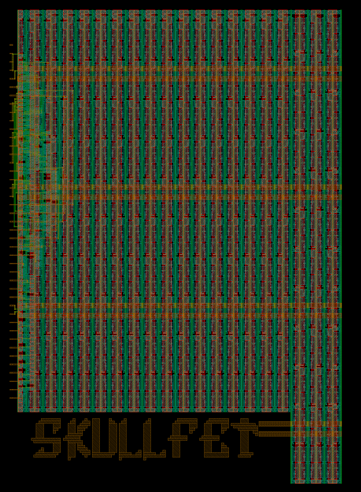

   

# TT Logo Digital Integration Test



A guided template for integrating a logo into a digital TinyTapeout design.

_Skullfet logo courtesy of: Uri Shaked_

---
> [!NOTE]
> This will not work on analog designs currently using OpenLane2 without a unecessary amount of work.
> If you insist on using openlane to automate this or are interested in a mixed-signal flow, please see the following repository and configuration files: [tt-gds-macro-testing](https://github.com/watbulb/tt-gds-macro-testing/blob/38763eb4b36b52dedca737d9cb8cb1168800b621/src/ttlogo_config.json#L7). There will be a seperate analog repostiory created with a set of magic scripts to instance your logo appropriately, otherwise it is very simple to just import a logo macro cell into an existing analog magic design, be it a GDS or MAG instance.

## Table of Contents

- [TT Logo Digital Integration Test](#tt-logo-digital-integration-test)
  - [Table of Content](#table-of-contents)
  - [Requirements](#requirements)
  - [Getting Started](#getting-started)
  - [Logo Rules](#logo-rules)
  - [Logo Input Types](#logo-input-types)
    - [MAG Logos](#mag-logos)
    - [GDS Logos](#gds-logos)
    - [SVG Logos](#svg-logos)
  - [Integration into your project](#integration-into-your-project)
    - [Makefile Integration](#makefile-integration) 
    - [Configuration Changes](#configuration-changes)
    - [Sources Changes](#source-changes)
  - [Feedback and Issues](#feedback-and-issues)
  - [Guide Contributors](#guide-contributors)

## Requirements

- Python3
- GNU Make

Options:
- Magic:
  - For MAG logo handling
- KLayout:
  - For raw GDS and SVG logo handling
- rsvg-convert:
  - For SVG logo handling

## Getting Started

So you want to put a neat little logo on your awesome TinyTapeout design, but you aren't sure where to start?
Well you've come to the right place!

Depending on the original artwork format you are starting out with, there are a few different paths you can take which are supported by the tools in this repository. We won't cover how to create your art or logo, that's up to you. But we will cover some rules you will need to be aware of when making your art/logo, and how you can sucesfully integrate it into a new or existing digital design. Because raw GDS and SVG logos are only supported as a compatiblity measure, it is best you begin your logo design in either Magic or KLayout directly, and export to magic files (.MAG). This is primairly due to information loss when working with raw GDS or SVG files (for example), higher level data formats such as magic files contain the required information to generate the LEF files that OpenLane requires for the PnR steps.
> [!WARNING]
> If you only have a GDS or SVG file, and do not have a corresponding LEF file, the Makefile will take a best-effort approach
> to convert the SVG to GDS and/or extract the polygons and pins from the GDS metal layers using KLayout and `scripts/gds2lef.py`.
> Check to see if the program you created the GDS with supports LEF output. 
> This can be done in both Magic (`lef write`) and KLayout. Your success may vary.

**Starting with Magic:**

If you are starting with magic, ensure you begin by importing a TinyTapeout DEF template to verify you are staying within
your tile-size bounds. This can be done using the following command (assuming the `tt-support-tools` repo has been checked out locally as it is here):

```shell
def read tt/def/tt_block_1x1_pg.def
```

Now press **(V)** to display the full template block area. You want to make sure your logo fits reasonably within these bounds.


Paths to take based on input file type:

- [MAG](#MAG-Logos)
- [GDS](#GDS-Logos)
- [SVG](#SVG-Logos)

## Logo rules

> [!TIP]
> Some rules apply to creating logo's that you should be aware of before creating them.

The option offered in this repository allows a user to create a blackbox macro of their logo design, and place it inside
a "keep-out" area which goes all the way down to the bottom layer. This means the user is free to use any layer between the
bottom and the metal4 layer. Although you will probably want to stick to metal layers only (this needs verification).

**1. Use fillblock layers:**

Even though we are going to be creating some keep-out regions in our OpenLane config to prevent PDN and routing
over our logo area, it's still a good practice to also include fillblocks around your logo depending on the metal layers used in your design.

The layer "fillblock" will block fill on all metal layers.

These fillblock layers are:
- `62/24` for metal1
- `105/52` for metal2
- `107/24` for metal3
- `112/4` for metal4.

**2. Don't make your logo larger than 25% of the total design size:**

Because we create keep-out areas by essentially fillblocking, too much fill blocking will cause the whole design to fail to meet density spec.

> [!NOTE]
> This hasn't actually been confirmed yet, but is a suspicion. 

**3. Make sure your logo has a PR boundary layer:**

For reasons beyond my knowledge, a placed macro in a digital design requires a PR boundary layer to be defined. This layer is `235/4`.
A provided script (`./script/gds_add_prb.py`) will handle this for you through the Makefile, but you are free to run it youself to add the boundary
around a single top-level cell in your GDS file.

**4. Do not add pins or power nets to your logo:**

Creating pins and/or power nets on your logo design will lead to headaches during the OpenLane flow if your logo does not actually uses these things.
In the case of Uri Shaked's Skullfet art, these parts are FETs and thus require power, but this will be unecessary for most logos.

**5. Do not place the logo on the very bottom corner of the design:**

If the logo is placed on the bottom corner of the design, the PDN may not like it, move it up and to the left/right a little bit.

## Logo Input Types

### MAG Logos

For Magic logos, simply copy your logo to `logo/mag/logo.mag`.

Now the magic file can be processed into GDS and LEF files:

```shell
# clear existing files
$ make clean_logo
# process logo
$ make
```

The processed outputs are automatically placed in `logo/{gds,lef}`.

For reference, the above make command will run the following commands to produce your GDS and LEF files:

```shell
# Generate GDS
$ echo "gds write logo/gds/logo.gds" | \
    magic -rcfile $PDK_ROOT/sky130A/libs.tech/magic/sky130A.magicrc -noconsole -dnull logo/mag/logo.mag

# Add PR boundary layer to GDS
$ ./script/gds_add_prb.py logo/gds/logo.gds

# Generate LEF
$ echo "lef write logo/lef/logo.lef -pinonly" | \
    magic -rcfile $PDK_ROOT/sky130A/libs.tech/magic/sky130A.magicrc -noconsole -dnull logo/mag/logo.mag
```

### GDS Logos

For raw GDS logos, as previously noted, if you do not have a LEF file, one will be created for you using a best-effort approach.
However, you should still investigate if the tool you used to crete the raw GDS can export LEF files as well.

Place your GDS (and optionally but preferred LEF file in):

- `logo/gds/logo.gds`
- `logo/lef/logo.lef`

Now the GDS file can be processed into GDS and/or LEF files:

```shell
# clear existing files
$ make clean_logo
# process logo
$ make
```

The processed outputs are automatically placed in `logo/{gds,lef}`.

For reference, the above make command will run the following commands to process your GDS and LEF files:

```shell
# Add PR boundary (or skip if present) to raw GDS
$ ./script/gds_add_prb.py logo/lef

# If LEF is not found, we generate it
$ klayout -zz -rd gds_path=./logo/gds/logo.gds -rd out_file=./logo/lef/logo.lef -rm ./script/gds2lef.py
```

### SVG Logos

For raw SVG logos, we first process the SVG into GDS, taking into consideration width, height and pixel size in microns.

First, place your logo in the file: `logo/img/logo.svg`.

Now the SVG file can be processed into GDS and LEF files. There are three optional parameters to be aware of when processing for this file-type.

- `LOGO_IMG_H`: Image Pixel Max Height (Default: 64)
- `LOGO_IMG_W`: Image Pixel Max Width  (Default: 64)
- `LOGO_IMG_U`: Image Pixel size multiplier in microns (Default: 1)

The default configuration allows input SVGs to be distilled down into 64x64x1um/per-pixel sized GDS inputs.
This may be too large or too small for your purposes, so it can be configured during build-time like:

```shell
# clear existing files
$ make clean_logo
# process logo
make LOGO_IMG_H=<my height> LOGO_IMG_W=<my width> LOGO_IMG_U=<my pixel size multiplier>
```

The processed outputs are automatically placed in `logo/{gds,lef}`. Check these files in a GDS viewer to ensure the sizing is correct.

For reference, the above make command will run the following commands to process your GDS and LEF files:

```shell
# Convert SVG to PNG
$ rsvg-convert logo/img/logo.svg -w 64 -h 64 -o logo/img/logo.png

# Convert PNG to GDS (-u is pixel size in um) and automatically add PR boundary.
$ ./script/make_gds.py -u 1 -c logo -i logo/img/logo.png -o $@

# Generate LEF from GDS
$ klayout -zz -rd gds_path=./logo/gds/logo.gds -rd out_file=./logo/lef/logo.lef -rm ./script/gds2lef.py
```

## Integration into your project

### Makefile Integration

> [!NOTE]
> This step is optional

To integrate the above steps into your project, you have a few options:

1. If you don't use a makefile, simply copy it to your repository, and use it as described here.
2. If you have a Makefile, copy the Makefile in this repository to `Makefile.logo` in your repository.
    1. Add the following to the top of your Makefile:
    ```Makefile
    USE_LOGO ?= 1
    include Makefile.logo
    ```
    2. Add `LOGO_TARGETS` to your primary target (for example)
    ```Makefile
    all: $(MY_OTHER_TARGETS) $(LOGO_TARGETS)
    ```
3. Write your own build scripts / files which implement the commands shown for each input file type you use.

At any time, you can prevent the logo generate steps from running by defining `make USE_LOGO=0` or by
directly overriding the variable in your Makefile. If you would like to clean the generated logo assets, you
can use the make target `clean_logo` while `USE_LOGO=1` is defined.

### Configuration Changes

Now we need to integrate some changes into our project configuration to make this work. The changes are fairly non-invasive:

```json
  "//": "tt-logo-digital-test BEGIN",
  "//": "tt-logo-digital-test BEGIN",

  "//": "set the name of the logo you want to use",
  "//": "Eg. LOGO_NAME=ttlogo LOGO_INSTANCE=um_ttlogo",
  "VERILOG_DEFINES": ["LOGO_NAME=logo", "LOGO_INSTANCE=um_logo", "USE_LOGO"],
  "IGNORE_DISCONNECTED_MODULES": ["um_logo", "logo"],

  "//": "obstruct our macro on the decap layer, etc",
  "PDN_OBSTRUCTIONS": [
    "met4 0 30 30 75"
  ],
  "ROUTING_OBSTRUCTIONS": [
    "met4 0 30 30 75"
  ],
  "//": "disabled on this for now, its fine in reality",
  "RUN_LVS": false,

  "//": "macro keepout halo (microns)", 
  "PL_MACRO_HALO": "60 60",
  "FP_PDN_HORIZONTAL_HALO": 1,
  "FP_PDN_VERTICAL_HALO": 1,

  "MACROS": {
    "logo": {
      "instances": {
        "um_logo": {
          "location": [
            0,
            30
          ],
          "orientation": "E"
        }
      },
      "gds": [
        "dir::../logo/gds/logo.gds"
      ],
      "lef": [
        "dir::../logo/lef/logo.lef"
      ]
    }
  },

  "//": "tt-logo-digital-test END",
  "//": "tt-logo-digital-test END",
```

We first begin by defining some verilog defines to make our blackbox module easily compile without having to worry about
how or where its configured in the design, this will be clearer in the Source Changes section below:

`"VERILOG_DEFINES": ["LOGO_NAME=logo", "LOGO_INSTANCE=um_logo", "USE_LOGO"]`

Next, we let OpenLane know it's okay that our logo macro module doesn't use any nets, so it doesn't get paranoid about it being a disconnected macro:

`"IGNORE_DISCONNECTED_MODULES": ["um_logo", "logo"],`

Next, we define a keep-out area for the DRT/GRT and PDN phases of OpenLane2 routing and placement. Ensure these values closely align with the bounds size
of your logo, or else you will encounter placement and disconnection errors during DRC and LVS. The Halo parameters define a keep-out halo in microns which will surround
the logo. This could be accomplished directly using the OBSTRUCTIONS parameters, but both options can work:
```json
  "//": "obstruct our macro on the decap layer, etc",
  "PDN_OBSTRUCTIONS": [
    "met4 0 0 120 50"
  ],
  "ROUTING_OBSTRUCTIONS": [
    "met4 0 0 120 50"
  ],

  "//": "macro keepout halo", 
  "PL_MACRO_HALO": "40 40",
  "FP_PDN_HORIZONTAL_HALO": 1,
  "FP_PDN_VERTICAL_HALO": 1,
```

Finally, we define our logo macro placement itself:

```json
  "MACROS": {
    "logo": {
      "instances": {
        "um_logo": {
          "location": [
            5,
            5
          ],
          "orientation": "N"
        }
      },
      "gds": [
        "dir::../logo/gds/logo.gds"
      ],
      "lef": [
        "dir::../logo/lef/logo.lef"
      ]
    }
  },
```

For more information on this MACRO section, please see the following OpenLane2 resource:
https://openlane2.readthedocs.io/en/latest/usage/using_macros.html

### Source Changes

We're on the home stretch! The final part we need to do is add our logo definition file (`logo.vh`) to our `src/` folder, and instantiate our blackbox macro inside our top-level project module (`tt_um_example`):

Add the following to the top of the `project.v` top-level file:

```verilog
`ifdef USE_LOGO
`include "logo.vh"
`endif
```

Instantiate the blackbox module macro inside the top-level module:

```verilog
project.v:
module tt_um_example (
  ...
);
  // Add logo design
`ifdef USE_LOGO
  (* keep *)
  `LOGO_NAME `LOGO_INSTANCE();
`endif
...
endmodule
```

Copy the `logo.vh` file to your `src/` directory:
```verilog
`ifndef LOGO_NAME
`define LOGO_NAME logo
`endif
`ifndef LOGO_INSTANCE
`define LOGO_INSTANCE um_logo
`endif

(* blackbox *)
module `LOGO_NAME ();
endmodule
```

And that's it! Give it a try with github actions, or optionally if you have local hardening, run it:
```shell
$ ./tt/tt_tool.py --harden --openlane2
```

It may take a few tries to get the tuning correct on the keep-out sizing and positioning, but for the most part that should be all you need to do. Let me know on discord (@watbulb) how you make out!

## Feedback and Issues

Please feel free to open an issue if you'd like to share any feedback or your experiences.

## Guide Contributors

- Dayton Pidhirney (watbulb)